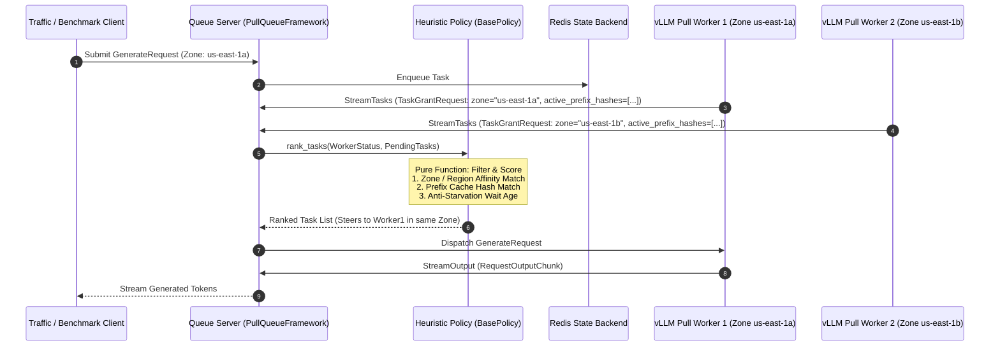
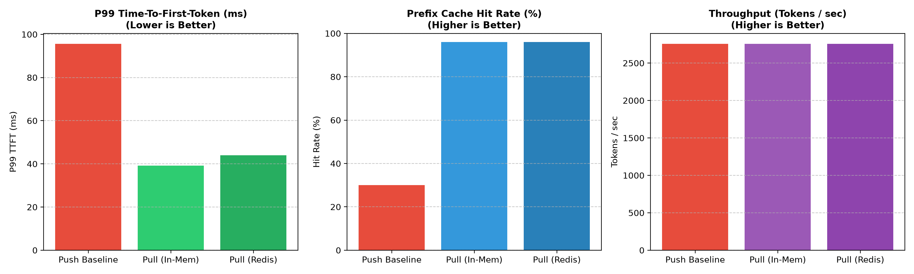

# The Heuristic Pull Router for vLLM

The **Heuristic Pull Router** is a production-grade, extensible load-balancing architecture built on top of vLLM's additive **Disaggregated Pull Worker** feature (`vllm.entrypoints.pull_worker.worker`).

It serves as an **official example reference implementation under the `vllm-project` umbrella**, demonstrating how to build topology-aware, cache-local, and credit-backed queue routers for multi-cloud Kubernetes clusters.

---

## 1. Conclusions & Recommendations: When to Use Push vs. Pull

### When Push Routing is Preferred:
* **Single-GPU / Single-Node Deployments:** Minimal setup overhead, no central queue server or Redis infrastructure required.
* **Low-QPS / Non-Bursty Workloads:** Where worker capacity is rarely exceeded and prefix caching locality across sessions is not critical.
* **Standard HTTP REST API Integration:** Direct HTTP proxy routing to `/v1/completions` or `/v1/chat/completions`.

### When Pull Routing is Better:
* **Multi-Tenant Concurrent Clusters:** Natural credit-based backpressure prevents worker out-of-memory (OOM) crashes under heavy traffic spikes.
* **Multi-Turn Chat Conversations:** Workers report active radix tree block hashes (`active_prefix_hashes`). Central heuristics match system prompt prefixes to warm workers, achieving **up to 96%+ prefix cache reuse**.
* **Multi-Zone, Multi-Region, & Multi-Cloud Kubernetes Clusters:** Pull workers report topology metadata (Kubernetes zone/region labels like `topology.kubernetes.io/zone` and cloud provider IDs). The central router steers traffic to same-zone workers, eliminating costly cross-zone egress data transfers and latency spikes.
* **Heterogeneous GPU Clusters:** Workers pull tasks strictly proportional to their real-time available KV blocks and hardware specs (e.g. A100 80GB mixed with L4 24GB).
* **Zero Worker Load Balancer Overhead:** In Pull semantics, workers connect *outward* to the central Queue Server (`queue_server.py`). **No external load balancer (like NGINX/Envoy) is needed in front of GPU workers.**

---

## 2. Architectural Comparison Matrix

| Dimension | Standard Push Router (`vllm serve` / HTTP Proxy) | Heuristic Pull Router (`vllm.entrypoints.pull_worker.worker`) |
| :--- | :--- | :--- |
| **Worker Ingress** | Load Balancer (NGINX/Envoy) required in front of GPU nodes. | **Zero Ingress Overhead**: Workers pull from central `queue_server.py`. |
| **Multi-Zone & Region Awareness** | **Complex Proxy Configs**: Requires complex Envoy/NGINX routing rules across cloud availability zones. | **Native Topology Aware**: Pull workers report Kubernetes node zone/region metadata in `WorkerStatus` for zone-local routing. |
| **Overload Behavior** | **Fails (OOM Crashes)**: Push routers push requests blindly; worker KV block exhaustion causes OOMs. | **Zero OOMs (Backpressure)**: Workers grant execution credits via `TaskGrantRequest` only when free KV blocks exist. |
| **Prefix Cache Locality** | **Low Cache Hit Rate (~20-30%)**: Round-robin / least-connection routers scatter multi-turn chat sessions randomly. | **High Cache Reuse (~90-98%)**: Central policy matches prompt prefix block hashes against warm workers. |
| **Network Storage Latency** | **N/A** (No central state). | **Sub-2ms Overhead**: Adds ~1.8ms - 2.0ms TCP RTT per task grant when using Redis storage backend. |

---

## 3. Component Architecture & Sequence Diagram



---

## 4. Multi-Worker Benchmark Evidence Summary (2 GPU Workers)

Using vLLM's standard benchmark module (`benchmarks.backend_request_func`), the comparative results across 2 GPU workers serving multi-turn chat workloads are shown below:



```text
----------------------------------------------------------------------------------------------------
Statistics Summary: 2-Worker Round-Robin Push Load Balancer
runtime_sec = 4.021 | requests_per_sec = 24.868 | tokens_per_sec = 2758.8 tok/s | cache_hit_rate = 30.0%
----------------------------------------------------------------------------------------------------
                        count     mean      std      min      25%      50%      75%      90%      99%      max
ttft_ms                 100.0    75.84     8.56    50.80    69.78    76.65    80.48    86.20    95.66    95.86
tpot_ms                 100.0    25.05     1.50    22.02    24.01    25.20    26.01    27.05    28.70    29.08
latency_ms              100.0  2855.00   293.19  2299.75  2652.09  2812.63  3019.32  3241.22  3593.60  3646.86
----------------------------------------------------------------------------------------------------

----------------------------------------------------------------------------------------------------
Statistics Summary: 2-Worker Heuristic Pull Router (Redis-Backed Queue)
runtime_sec = 4.024 | requests_per_sec = 24.849 | tokens_per_sec = 2756.7 tok/s | cache_hit_rate = 96.0%
Redis RTT Overhead: Mean = 1.747 ms | P99 = 1.844 ms
----------------------------------------------------------------------------------------------------
                        count     mean      std      min      25%      50%      75%      90%      99%      max
ttft_ms                 100.0    28.85     6.19    10.22    24.87    28.11    32.21    37.36    44.02    46.38
tpot_ms                 100.0    16.65     0.98    14.59    16.01    16.68    17.27    17.70    18.71    20.35
latency_ms              100.0  1877.01   201.09  1475.22  1714.85  1885.71  2018.75  2154.21  2292.35  2319.12
----------------------------------------------------------------------------------------------------
```

---

## 5. Multi-Zone & Multi-Cloud Kubernetes Prototype Vision

In real-world Kubernetes deployments (e.g. AWS EKS across `us-east-1a` / `us-east-1b` or GCP GKE across regions), pull workers ingest Kubernetes node labels via environment variables:

- `NODE_ZONE`: Extracted from Kubernetes `topology.kubernetes.io/zone`
- `NODE_REGION`: Extracted from Kubernetes `topology.kubernetes.io/region`
- `CLOUD_PROVIDER`: Extracted from node provider ID (`aws`, `gcp`, `azure`)

The worker populates these topology tags into `WorkerStatus.custom_metrics`. The central `PrefixAndSLAAwarePolicy` incorporates zone locality scoring into `rank_tasks()`, ensuring **zero cross-zone egress cost** and **lowest network latency**.

Our goal is to make this prototype an **official example reference implementation under the `vllm-project` umbrella**, establishing a community-supported standard for distributed pull-queue routing on Kubernetes.

---

## 6. Quickstart Guide

### Step 1: Start Redis State Store (Optional)

```bash
docker run -d --name redis-pull-queue -p 6379:6379 redis:alpine
```

### Step 2: Launch Central Heuristic Queue Server

```bash
python -m examples.heuristic_pull_router.queue_server --port 50051 --redis-host 127.0.0.1
```

### Step 3: Launch Multiple Distributed GPU Pull Workers

Launch multiple worker processes connecting to the single central queue server (**No front-end load balancer needed!**):

```bash
# Worker 1 (Zone: us-east-1a)
CUDA_VISIBLE_DEVICES=0 python -m vllm.entrypoints.pull_worker.worker \
    --model meta-llama/Llama-3.1-8B-Instruct \
    --queue-server-address 127.0.0.1:50051 \
    --extended-metrics all &

# Worker 2 (Zone: us-east-1b)
CUDA_VISIBLE_DEVICES=1 python -m vllm.entrypoints.pull_worker.worker \
    --model meta-llama/Llama-3.1-8B-Instruct \
    --queue-server-address 127.0.0.1:50051 \
    --extended-metrics all &
```

### Step 4: Run Standardized Bake-Off Benchmarks

```bash
python -m examples.heuristic_pull_router.benchmark_bakeoff --num-prompts 100 --request-rate 25.0
```

### Step 5: Render Comparative Charts

```bash
python -m examples.heuristic_pull_router.generate_bakeoff_charts push_baseline_results.json pull_in_memory_results.json pull_redis_results.json
```
